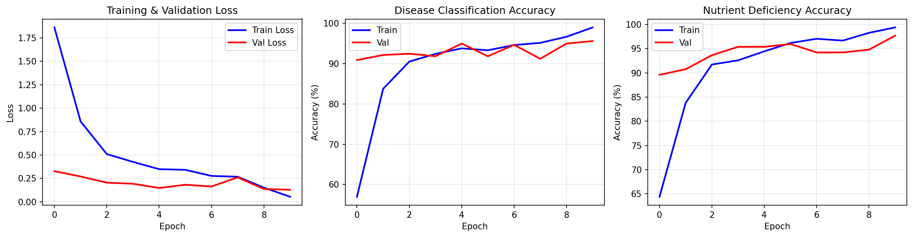
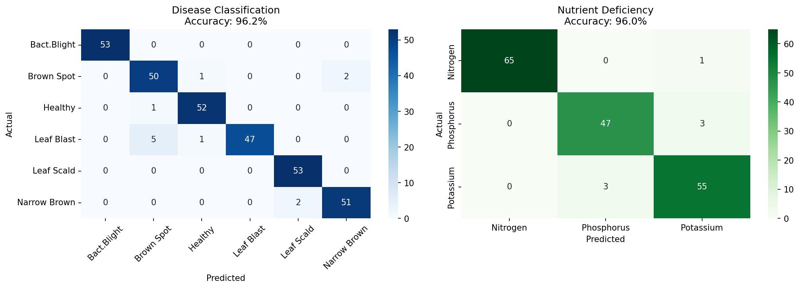
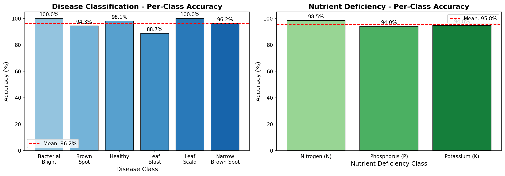
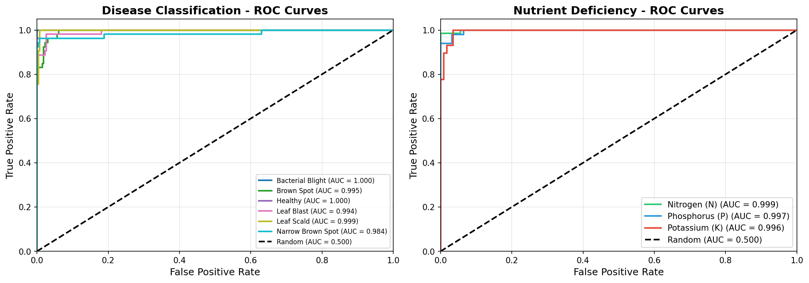
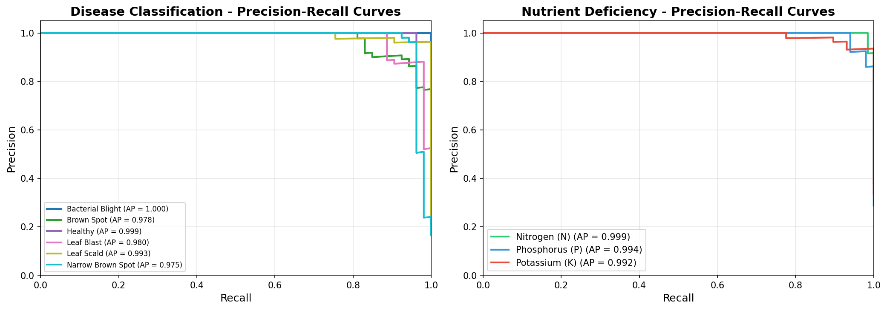

# 🌾 MTL-ViT: Multi-Task Vision Transformer for Rice Crop Health

A deep learning model that simultaneously detects **rice leaf diseases** and **nutrient deficiencies** using a shared Vision Transformer backbone.

## 📊 Results

| Task | Accuracy | AUC Score |
|------|----------|-----------|
| Disease Classification | 96.2% | 0.995 |
| Nutrient Deficiency | 96.0% | 0.997 |

## 🏗️ Architecture
```
Input Image (224×224×3)
        ↓
┌─────────────────────────────┐
│   ViT-Base-Patch16-224      │
│   (Pretrained Backbone)     │
│   86M parameters            │
└─────────────────────────────┘
        ↓
   Feature Vector (768 dims)
        ↓
   ┌────┴────┐
   ↓         ↓
┌──────┐  ┌──────┐
│Disease│  │Nutrient│
│ Head  │  │ Head   │
└──────┘  └──────┘
   ↓         ↓
6 classes  3 classes
```

## 🔬 Classes

### Disease Classes (6)
- Bacterial Leaf Blight
- Brown Spot
- Healthy
- Leaf Blast
- Leaf Scald
- Narrow Brown Spot

### Nutrient Deficiency Classes (3)
- Nitrogen (N) Deficiency
- Phosphorus (P) Deficiency
- Potassium (K) Deficiency

## 🚀 Quick Start

### Installation
```bash
pip install -r requirements.txt
```

### Inference
```bash
python src/inference.py --model models/MTL_ViT_Complete.pth --image path/to/leaf.jpg
```

## 📈 Training Curves



## 📊 Confusion Matrices



## 📊 Per-Class Accuracy



## 📈 ROC Curves



## 📈 Precision-Recall Curves



## 🛠️ Tech Stack

- Python 3.10+
- PyTorch 2.0+
- timm (Vision Transformer)
- scikit-learn
- matplotlib

## 📁 Project Structure
```
MTL-ViT-Rice-Disease-Detection/
├── src/
│   ├── model.py          # Model architecture
│   ├── dataset.py        # Data loading
│   └── inference.py      # Prediction code
├── outputs/              # Graphs and results
├── requirements.txt
└── README.md
```

## 👨‍💻 Author

**Abhineet**  
Third Year, Computer Science  
SRM Institute of Science and Technology

## 📄 License

This project is for educational purposes.
