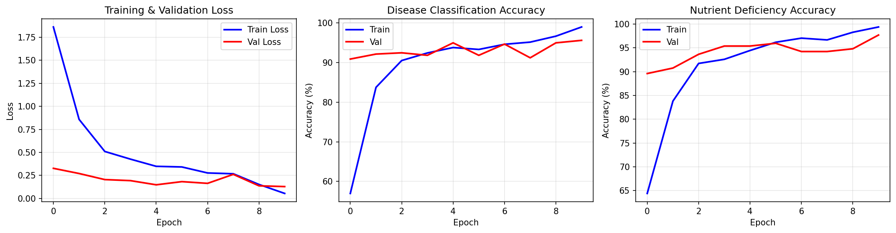
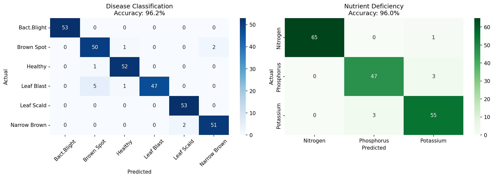
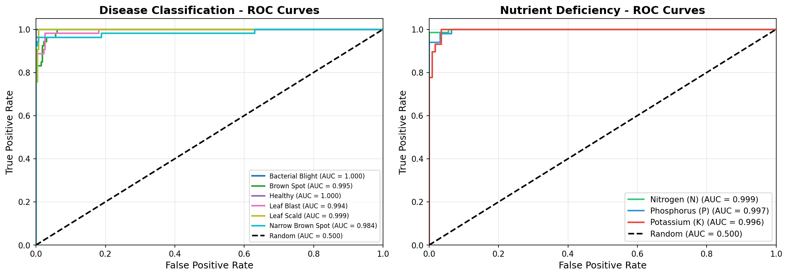
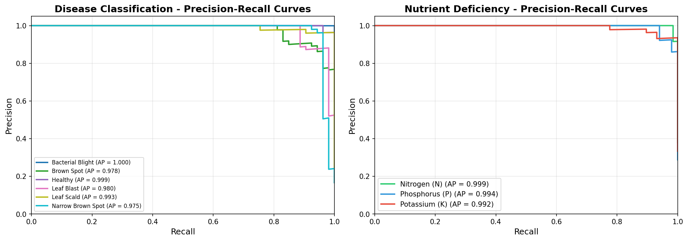

<h1 align="center">🌾 MTL-ViT: Multi-Task Vision Transformer for Rice Crop Health</h1>

<p align="center">
  
  
  
  
  
</p>

<p align="center">
  
  
  
  
</p>

<p align="center">
  <b>Simultaneously detects rice leaf diseases AND nutrient deficiencies using a shared Vision Transformer backbone — achieving 96%+ accuracy on both tasks.</b>
</p>

---

## 🎯 What It Does

Most crop disease models tackle **one problem at a time**. This system uses **multi-task learning** to:
- 🦠 Classify **6 types of rice leaf diseases** (Bacterial Leaf Blight, Brown Spot, Leaf Blast, etc.)
- 🌿 Detect **3 types of nutrient deficiencies** (Nitrogen, Phosphorus, Potassium)

Both predictions happen in a **single forward pass** from the same ViT backbone — more efficient and more accurate than two separate models.

---

## 📊 Results

| Task | Accuracy | AUC Score |
|------|----------|-----------|
| Disease Classification | **96.2%** | **0.995** |
| Nutrient Deficiency | **96.0%** | **0.997** |

> Evaluated on held-out test set. Training curves, confusion matrices, ROC and PR curves available in [`/outputs`](./outputs).

---

## 🏗️ Architecture

```
Input Image (224×224×3)
        ↓
┌─────────────────────────────┐
│   ViT-Base-Patch16-224      │
│   (Pretrained on ImageNet)  │
│   86M parameters            │
└─────────────────────────────┘
        ↓
   Shared Feature Vector (768 dims)
        ↓
   ┌────────┴────────┐
   ↓                  ↓
Disease Head       Nutrient Head
(6 classes)        (3 classes)
```

The model uses **transfer learning** from a ViT-Base pretrained on ImageNet-21k, fine-tuned end-to-end with a joint loss function:

```
Total Loss = α × CrossEntropy(disease) + β × CrossEntropy(nutrient)
```

---

## 🔬 Classes

| Task | Classes |
|------|---------|
| **Disease** | Bacterial Leaf Blight, Brown Spot, Healthy, Leaf Blast, Leaf Scald, Narrow Brown Spot |
| **Nutrient Deficiency** | Nitrogen (N), Phosphorus (P), Potassium (K) |

---

## 🚀 Quick Start

### 1. Clone & Install

```bash
git clone https://github.com/Abhineetraj07/MTL-ViT-Rice-Disease-Detection.git
cd MTL-ViT-Rice-Disease-Detection
pip install -r requirements.txt
```

### 2. Run Inference on a Leaf Image

```bash
python src/inference.py --model models/MTL_ViT_Complete.pth --image path/to/leaf.jpg
```

**Sample Output:**
```
Disease Prediction:   Leaf Blast       (confidence: 94.3%)
Nutrient Deficiency:  Nitrogen (N)     (confidence: 88.7%)
```

### 3. Launch the Gradio Web App

```bash
python app.py
```

Open `http://localhost:7860` → upload a rice leaf image → get instant predictions.

---

## 📈 Visual Results

| Training History | Confusion Matrix |
|-----------------|-----------------|
|  |  |

| ROC Curves | Precision-Recall |
|------------|-----------------|
|  |  |

---

## 📁 Project Structure

```
MTL-ViT-Rice-Disease-Detection/
├── src/
│   ├── model.py          # MTL-ViT architecture definition
│   ├── dataset.py        # Custom PyTorch Dataset with augmentations
│   └── inference.py      # Single-image prediction script
├── outputs/              # Training plots & evaluation graphs
├── app.py                # Gradio web demo
├── requirements.txt
└── README.md
```

---

## 🌐 Dataset

Based on publicly available rice disease image datasets. The model was trained on:
- Images resized to **224×224**
- Augmentations: Random flip, rotation, color jitter
- Train/Val/Test split: **70/15/15**

---

## 🛠️ Tech Stack


---

## 👨‍💻 Author

**Abhineet Raj** · CS @ SRM Institute of Science & Technology  
🌐 [Portfolio](https://aabhineet07-portfolio.netlify.app/) · 🐙 [GitHub](https://github.com/Abhineetraj07)

---

## 📄 License

This project is licensed under the MIT License.
